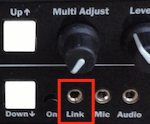
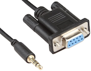
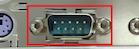
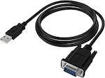
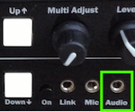
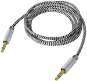
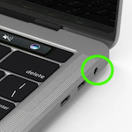
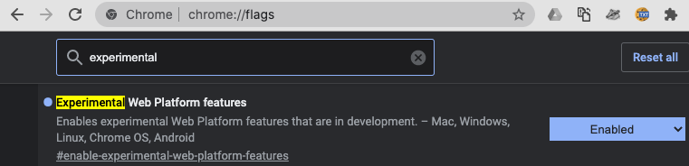

# How-To Guide

## Physically Connecting the ET-312
The ET-312 power unit connects to a computer via

|the "Link" port on the ET-312|a special cable|an RS-232 serial port on the computer (or adapter cable)|
|---|---|---|
|| | –or– 

All ET-312s have a link port; you may need to buy a Link Port cable and a USB-to-Serial adapter.

#### 1. "Link" Port Cable

The cable used to connect the ET-312 to a computer has a female DB9 serial plug on one end and a 3.5mm stereo plug on the other.  This cable is readily available from ErosTek and other sources:

* [Relper Lineso DB9Pin Female to DC3.5mm Serial Cable](https://www.amazon.com/gp/product/B06Y98F6D5)
* [EROSLINK SERIAL CABLE](https://erostek.com/collections/wiring/products/eroslink-serial-cable)

#### 2. Serial Port / RS-232 Adapter
RS-232 hardware is relatively rare on modern computers so a USB-to-serial adapter can be useful.  [Amazon has a wide selection](https://www.amazon.com/s?k=rs232+to+usb&i=electronics); be sure to choose a product that is compatible with your operating system.

The following two products have been tested and are known to work with ErosWeb running on a MacBook Pro with MacOS Catalina.  The TRENDnet device has also been tested on PCs running Windows 10:

* [Cable Matters USB C to Serial Adapter Cable](https://www.amazon.com/gp/product/B075GV6VL1/).  This fits directly into the "Thunderbolt 3" ports on the MacBook.
* [TRENDnet USB to Serial 9-Pin Converter Cable](https://www.amazon.com/gp/product/B0007T27H8/).  This uses a standard USB 1.1 connector.

Once the serial port hardware is installed and working according to the manufacturer's instructions (and drivers), it should automatically become available to Google Chrome or Edge and thus to ErosWeb.  You then will have a male "DB9" serial port attached to your computer, ready to connect to the cable going into the ET-312 Link port.

### E-Stim Audio

ErosWeb enables the Dom to send e-stim audio files to the sub via

|the "Audio" port on the ET-312 (**not** the "Mic" port)|a standard 3.5mm stereo audio cable|the headphone port on the computer|
|---|---|---|
||||

To feed this audio into the ET-312, connect the computer's headphone port to the ET-312 "Audio" jack using a standard 3.5mm stereo cable.  [Amazon has a wide selection](https://www.amazon.com/s?k=3.5mm+audio+cable&i=electronics) of these, too, or you may have one laying around.

Click on the "Settings" icon &#x2699; in ErosWeb sub mode to route E-stim Audio Output to the appropriate destination on the computer; this is usually different than the standard audio output used for voice communication (since you probably don't want to feed the Dom's voice into the ET-312).

E-stim audio playback and volume level is under the complete control of the Dom.

## Starting a Scene, step by step

These instructions pertain to the sub, who is responsible for technology set-up and presenting themselves for control by a Dom.

#### One-time Setup
1. Install the latest version of [Google Chrome][chrome] (if required), or make sure that [Microsoft Edge][edge] is up-to-date.
2. Search for "Experimental Web Platform Features" on the `chrome://flags` or `edge://flags` page and make sure that feature is enabled.

#### Linking the ET-312
1. Turn **off** the ET-312 box.
2. Connect the ET-312 "Link" port to your computer using a USB-to-Serial adapter cable (if required) and the special DB9-to-stereo-plug cable.
3. Using Google Chrome or Microsoft Edge, go to the [ErosWeb sub page](/sub.html).
4. Turn **on** the ET-312 box.
5. Click "Link ET-312" on the ErosWeb page.
6. Choose the serial port that the ET-312 is connected to. This may require some trial and error, especially on MacOS.  On MacOS, the correct port is usually indicated by `(tty.usbserial)`. 
7. Once connected, ErosWeb will report "ET-312 linked and ready" and display the current overall power level of the box (Low, Normal, or High).
8. You may still use the front panel controls to adjust the ET-312 output levels and mode _until a Dom connects_.  You can always control the overall power level of the box via the ErosWeb application.

#### Presenting

"Presenting" refers to making yourself and your ET-312 available for remote control over the Internet.  When ready,
1. Enter a "scene name" to identify yourself to the remote Dom.
2. Optionally, enter a PIN for added security.  Any remote Dom will need to know the PIN in order to connect.
3. Click "Present".
4. ErosWeb will report your Session ID.  Click on "Copy Link" to get a direct link to your session; send this to the remote Dom.  You can also just send the Dom the Session ID (and PIN, if any) so They can enter it into the [ErosWeb Dom page](/Dom.html).
5. You will be notified once the Dom connects.  At that point, **the front-panel controls of your ET-312 will become inactive**, and will instead be under the control of the remote Dom.

#### Sharing Audio and Video

Simply click "SHARE AUDIO/VIDEO" to communicate with the Dom via video chat.  You can select input and output devices (e.g. a headset) by clicking on the Settings &#x2699;  icon in the page header.

#### Scene Limits

You can set limits for the scene – including maximum power output – using the &#x1f6ab;  icon in the page header.

Be sure to click on the "close" icon in the upper-right corner of the Scene Limits sidebar to save any changes.

#### Ending the Scene

The scene ends when one of the following things happens:
* the Dom disconnects.
* you click the "End Scene" button.
* connectivity to the remote Dom is lost.

In any of these cases, ET-312 power output will ramp down and the box will go into a "paused" mode with no program selected.

If the Dom disconnected, another Dom can connect (or the original Dom can re-connect) and begin a new scene at any time until you press the "End Scene" button.

#### Unlinking the ET-312

&#9888;&#65039; You must "un-link" the ET-312 from ErosWeb when you are done with your scene.  This resets the connection to the box so that you can subsequently link to it again.  If you navigate away from the ErosWeb page without un-linking, you will need to turn the ET-312 off and then on again to reset it before you can link to it again.

## Controlling a Remote sub

1. Follow the link provided by the sub, or go to the [Dom page](/Dom.html) and enter the Session ID (and PIN, if any).
2. Enter a "scene name" to identify Yourself to the remote sub.
3. Click "Connect".

If the sub has not yet linked their ET-312 box, You will receive a warning message and the box controls will remain disabled.  You can still share audio and video or send an estim audio file.  The controls will become active as soon as the sub links their ET-312.

#### Sharing Audio and Video

Simply click "SHARE AUDIO/VIDEO" to communicate with the sub via video chat.  You can select input and output devices (e.g. a headset) by clicking on the "gear" &#x2699; icon in the page header.

#### Scene limits

The sub can disable the ability to change the box power level  and/or limit the maximum output level.  The sub can remove or change these limits in-scene.

## FAQ

_More Coming Soon!_

### E-Stim Audio

#### Why can't iPad control the volume level for e-stim audio files?

You need to enable iOS-specific functionality for the ErosWeb page.  Click on the "AA" icon in the Safari address bar and choose "Request Mobile Website."

The output volume on iOS devices like iPad can only be controlled by device buttons or operating system controls.  Changing the volume level in this way will change the volume for You (the Dom), but won't affect the sub.  The "mobile version" of the ErosWeb page detects this situation and correctly forwards volume change commands to the sub when you change the volume level control on the page, even though Your local volume doesn't change.

[chrome]: https://www.google.com/chrome/
[edge]: https://support.microsoft.com/en-us/help/4501095/download-the-new-microsoft-edge-based-on-chromium
